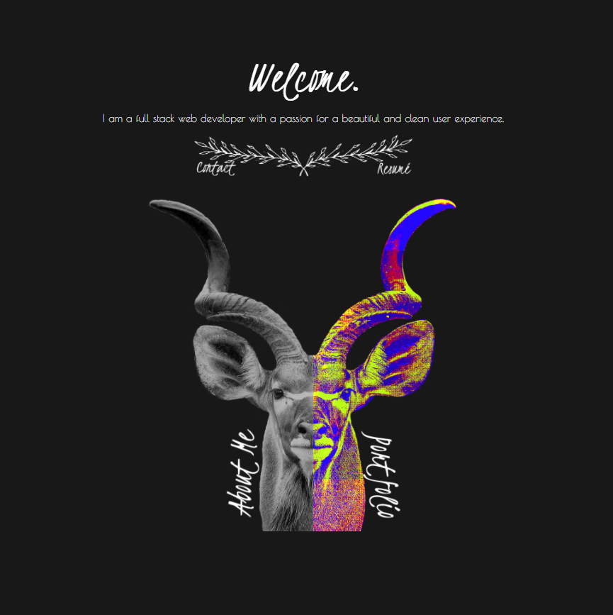

# # REACT EMPLOYEE DIRECTORY

This repository contains my portfolio site, including About Me, Contact and Portfolio pages. Repository is a React application and utilizes HTML, CSS, Javascript and jQuery.

---

## Table of Contents

- [Installation](#installation)
- [Usage](#Usage)
- [Acceptance Criteria](#acceptance-criteria)
- [Credits](#credits)
- [Resources](#resources)
- [Contact](#contact)
- [Links](#Links)
- [License](#license)

---

## Installation

1. Follow the GitHub Repository Link in the [links](#Links) section below.
1. Clone the repository using an SSH key.
1. Open GitBash and use "git clone" to clone the repository.
1. Run npm install to install associated modules.

---

## Usage

Edit using VSCode after [installation](#installation). This is a React.js application, all files and components are included. This application is deployed to GitHub Pages, see [links](#Links) section below.

---

## Acceptance Criteria

#### Updated Portfolio

Your updated site should still have all of the content it previously had:

- Your name :heavy_check_mark:

- Links to your GitHub profile & LinkedIn page as well as your email address and phone number :heavy_check_mark:

- A link to a PDF of your resume with updated projects :heavy_check_mark:

- A list of projects. For each project, make sure you have the following:

  - Project title :heavy_check_mark:

  - Link to the deployed version :heavy_check_mark:

  - Link to the GitHub repository :heavy_check_mark:

  - GIF or screenshot of the deployed application :heavy_check_mark:

#### Design

As with the previous portfolio homework, "good" design is subjective. Your site should look
"polished." Here are a few guidelines on what that means:

- Mobile-first design :heavy_check_mark:

- Choose a color palette for your site so it doesn't just look like
  the default bootstrap theme or an unstyled HTML site. :heavy_check_mark:

- Make sure the font size is large enough to read, and that the colors don't cause eye strain. :heavy_check_mark:

- If you want to go above and beyond, try using animations and react component libraries. Note
  that this will _not_ affect your grade, but it may impact how potentials employers gauge your knowledge. :heavy_check_mark:

#### React

Additionally, this new portfolio should be created using React. :heavy_check_mark:

At a minimum, your portfolio should include the following:

- A `Header` component that appears on multiple pages :heavy_check_mark:

- A single `Project` component that will be used multiple times on a single page :heavy_check_mark:

- Navigation with React Router, dynamic rendering, or another third part router :heavy_check_mark:

- A `Footer` component that appears on multiple pages :heavy_check_mark:

#### Updated LinkedIn Profile

Make sure to update your LinkedIn Profile with the new skills you've acquired since the last time it was updated.:heavy_check_mark:

---

## Credits

As always, a huge thanks to our instructional staff for all their hard work!

## Resources

- [w3schools](https://www.w3schools.com)
- [Node.js](https://nodejs.org/en/)
- [React.js](https://reactjs.org/)
- [Bootstrap](https://getbootstrap.com/)

---

## Contact

Find me on LinkedIn Here:
[Aimee Esler](https://www.linkedin.com/in/aimee-esler-3bb31288/)

---

## Links

[Repository Link](https://github.com/aimeecesler/portfolio)

[Deployed Application](https://www.aimeecesler.com)

---

## License

Copyright &copy; 2020 Aimee Corbin Esler

    Permission is hereby granted, free of charge, to any person obtaining a copy
    of this software and associated documentation files (the "Software"), to deal
    in the Software without restriction, including without limitation the rights
    to use, copy, modify, merge, publish, distribute, sublicense, and/or sell
    copies of the Software, and to permit persons to whom the Software is
    furnished to do so, subject to the following conditions:

    The above copyright notice and this permission notice shall be included in all
    copies or substantial portions of the Software.

    THE SOFTWARE IS PROVIDED "AS IS", WITHOUT WARRANTY OF ANY KIND, EXPRESS OR
    IMPLIED, INCLUDING BUT NOT LIMITED TO THE WARRANTIES OF MERCHANTABILITY,
    FITNESS FOR A PARTICULAR PURPOSE AND NONINFRINGEMENT. IN NO EVENT SHALL THE
    AUTHORS OR COPYRIGHT HOLDERS BE LIABLE FOR ANY CLAIM, DAMAGES OR OTHER
    LIABILITY, WHETHER IN AN ACTION OF CONTRACT, TORT OR OTHERWISE, ARISING FROM,
    OUT OF OR IN CONNECTION WITH THE SOFTWARE OR THE USE OR OTHER DEALINGS IN THE
    SOFTWARE.
